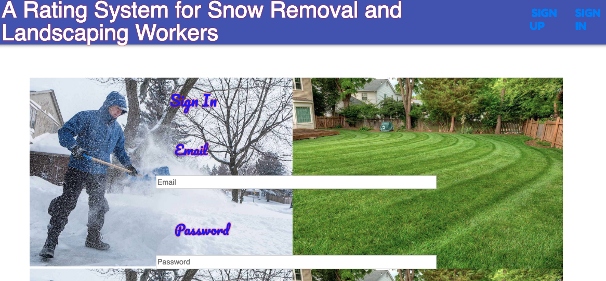

# What the app does and how it works

Heard of Yelp?  Well this is a yelp for people, a rating system that goes beyond businesses and into your personal world.  Facebook is social and connects people.  Linkedin is for getting a job and for companies.  Glassdoor allows anonymous ratings on companies and bosses.

It's about time that we as humans are allowed to rate anyone and everyone.  From a family member, to a classmate, to a teammate on a sports team, to a friend, to an ex-lover, or current-lover, review a boss, or an worker, review a customer, review your doorman, or your janitor, review the person who serves you coffee, you get the idea.

It works because there is a front end using React.js and a backend using Ruby on Rails w PostGRES

## Link to the other repo

- https://github.com/rogerdunnhawaii/360-review-api

## Link to both deployed sites

API: https://secret-cove-48656.herokuapp.com/
Client: https://rogerdunnhawaii.github.io/360-review-client/

## Technologies used

- React
- JavaScript
- HTML
- CSS

## Unsolved problems which will fixed later

1) Google maps integration
2) Facebook login integration
3) Text Email notification

# Planning, process, problem-solving strategy

- Created user Stories
- Created ERD
- Created wireframes
- Created Repos
- Created Readmes

## Link to wireframes and user stories

- As a user I would like to create a profile for myself
- As a user I would like to create profiles of others
- As a user I would like to leave reviews about others
- Link to Wireframes: https://drive.google.com/open?id=1IRYpBaEoLIOEK9TontrSzNgyrLIW1ZV0

## An embedded screenshot of the app

SCREENSHOT OF APP

## Set up and installation instructions for front end application

load it up by forking and cloning repo or going directly to website.  links are above.

## Structure

Currently, the top-level `App` component stores the currently authenticated
user in state, as well as data related to the flash messages. `App` renders the
`Header` component, and a list of routes, each of which render a component from
`src/auth/components`. The `auth` directory has two non-component files, `api`
and `messages`, which contain all the needed `fetch` calls, and messages to
display when API calls succeed or fail, respectively.

We recommend following this pattern in your app. For instance, if you are making
an app that keeps track of books, you might want a `books` directory next to
`auth`, which contains its own `api` and `messages` files, as well as a
`components` directory.

## Features

### `<AuthenticatedRoute />`

This template contains a handy component for creating routes that require a
user to be authenticated before visiting. This component lives in
`src/auth/components/AuthenticatedRoute.js` and is already required in `App`.
It's a thin wrapper around React Router's `<Route />` component. The only
difference is that it expects a prop called `user`, and if that prop is falsy,
it will render a `<Redirect />` that takes the user to `/`. **If you want to use
it, you must pass it the currently authenticated as a prop!**

It supports both the `component=` and `render=` attributes, but like `<Route />`
it will not forward props to the component if you use `component=`.

### Flash Messages

The `App` component has a rudimentary version of flash messages. To use it,
pass `this.flash` into a subcomponent of `App` as a prop and call it from there.
It expects two arguments: a message to display, and a message type, which is one
of `'flash-success'`, `'flash-warning'`, and `'flash-error'` which make the
message green, yellow, and red, respectively. You must pass one of these types.
You can add more types by adding more CSS rules in `App.scss`.

In the auth components, flash messages are used in conjunction with the
 `auth/messages` file to select from a list of predefined success/failure
 messages. To undertand how to do this, look at the definition of `flash` in
 `App.js`, the `signUp` method in `auth/components/SignUp.js`, and the
 `auth/messages.js` file.

 To change the duration of the message, replace `2000` with a value of your
 choice (in milliseconds) in the `flash` method definition in `App.js`.

 ### `src/apiConfig.js`

 Just like in
[browser-template](https://git.generalassemb.ly/ga-wdi-boston/browser-template),
this file will determine whether you're in a production or development
environment and choose an API URL accordingly. Don't forget to replace the
`production` URL with your deployed API's URL.

## Tasks

Developers should run these often!

- `npm run nag`: runs code quality analysis tools on your code and complains.
- `npm run make-standard`: reformats all your code in the JavaScript Standard
  Style.
- `npm run start`: generates bundles, watches, and livereloads.
- `npm run build`: place bundled styles and scripts where `index.html` can find
    them
- `npm run deploy`: builds and deploys master branch

## [License](LICENSE)

1. All content is licensed under a CC­BY­NC­SA 4.0 license.
1. All software code is licensed under GNU GPLv3. For commercial use or
    alternative licensing, please contact legal@ga.co.
